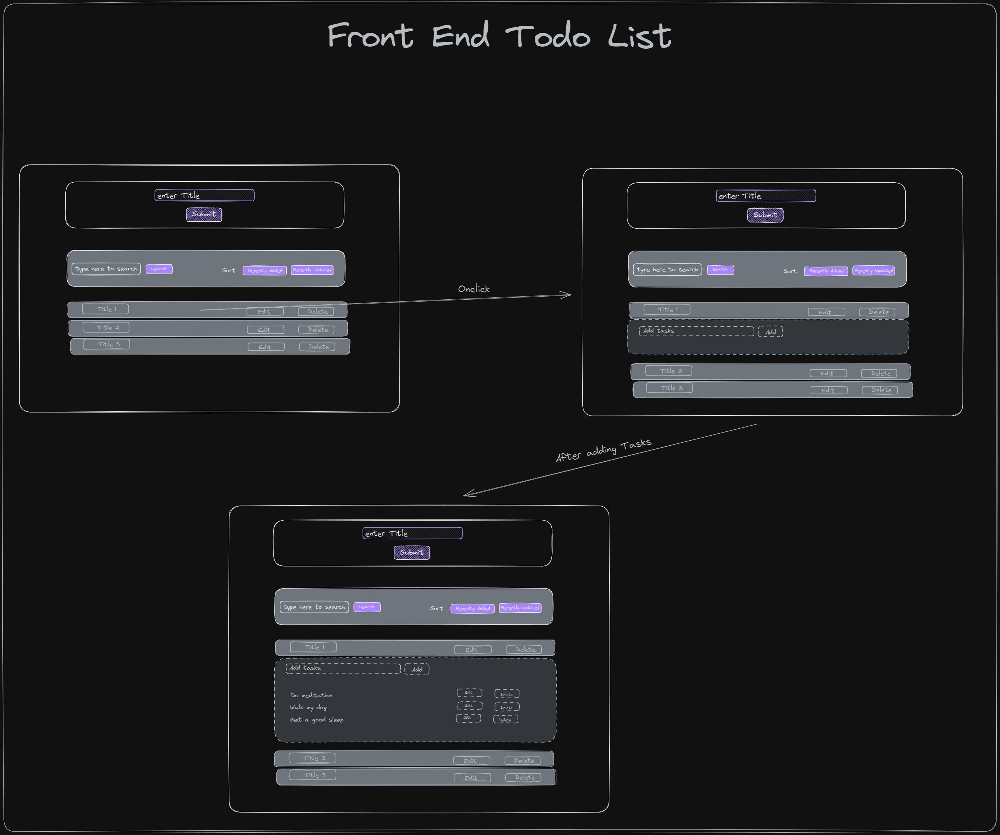
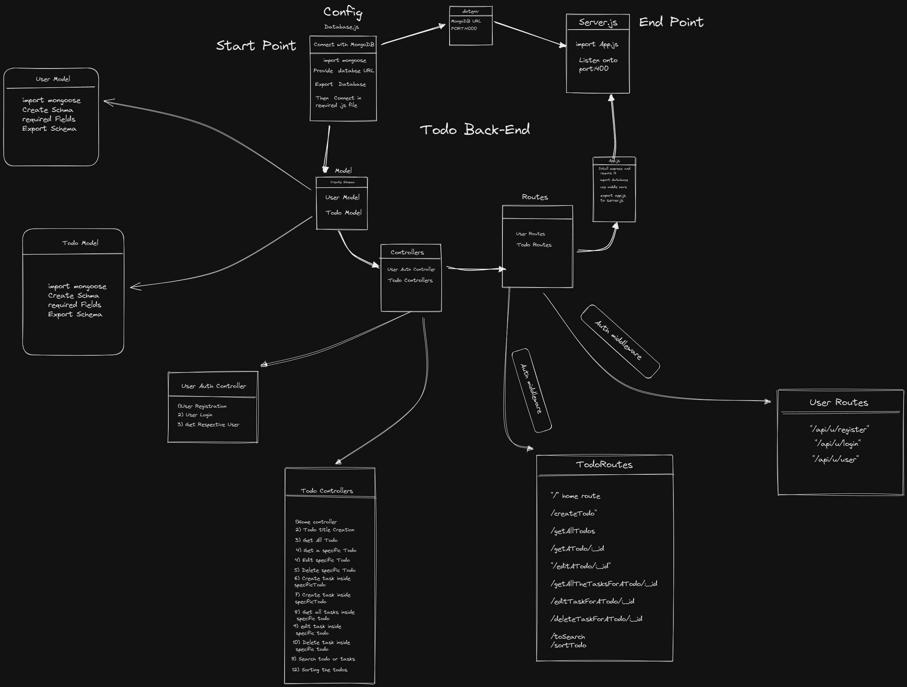
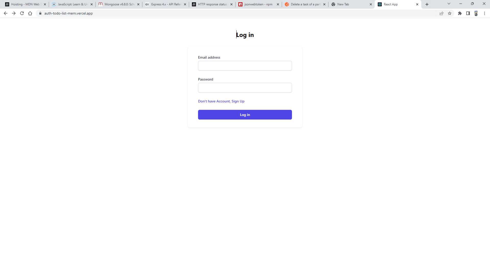
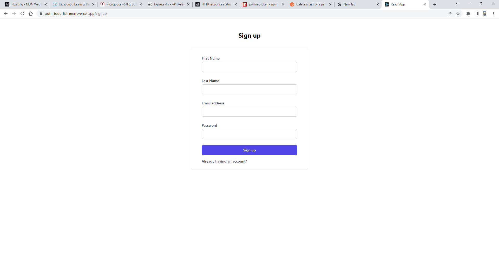
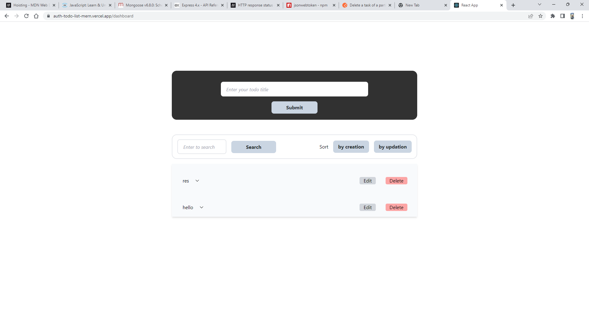

# Auth+Todo List

---

## Task

- In this assignment I have to create full stack MERN application with authetication and after this it should get to the dashboard of my todo.

- Where Schema model will be having:

  - User Schema (Username,password,email)

  - Title Schema

    - Title (Title for all the task e.g Sunday)
    - Tasks ( eg. on Sunday I'll do shopping, family time, movies etc.)

- No of controllers will be there for the title,tasks and user

- First Intention to create title then after adding it to the list I'll add extra task under it.

## Technologies (Will be used in it)

---

- Node.js
- Express.js(node.js Framework)
- Postman
- Mongoose(will connect to MongoDB)
- Other required packages.

---

## Demo Link

- [You Tube Playlist](https://www.youtube.com/watch?v=Jm2rvVBhgho&list=PLcdldFD2CQ3y8TjApZw5gZJCFPRUmmuhu&ab_channel=AnshulGhogre)

## Planning

### Frontend planning

---

### Backend planning

### After Implementation shots

---

### Time taken to complete

- Honest time taken to complete this is 2 weeks

---

### Learnings

- Learned the CRUD application in backend and understood the architecture of node.js
- Understood how to use react and use it with backend.
- overall gave me the confidence to do full stack project

---

## Live Links

- Front end...
  [Vercel](https://auth-todo-list-mern.vercel.app/)
- Back end...
  [Railway](https://auth-todo-list-mern-production-e11d.up.railway.app/)
