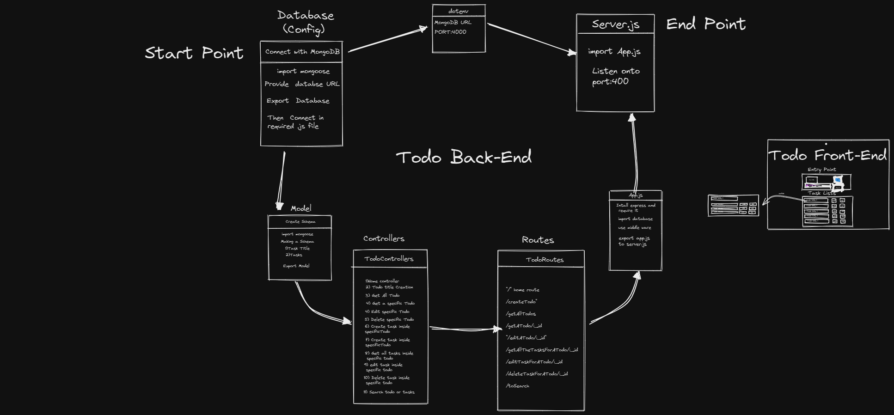

# Auth+Todo List

---

## Task

- In this assignment I have to create full backend procedure for the todo list with MERN.
- Where Schema model will be having:

  - Title (Title for all the task e.g Sunday)
  - Tasks ( eg. on Sunday I'll do shopping, family time, movies etc.)

- No of controllers will be there for the title and Tasks

- First Intention to create title then after adding it to the list I'll add extra task under it.

## Technologies (Will be used in it)

---

- Node.js
- Express.js(node.js Framework)
- Postman
- Mongoose(will connect to MongoDB)
- Other required packages.

---

## Plan

